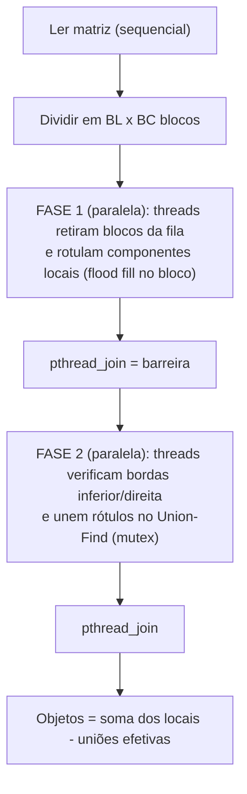

# Contagem paralela de objetos em uma matriz binária

Trabalho prático de **Sistemas Operacionais – 2026/II** (PUCRS – Escola Politécnica, Prof. Filipo Novo Mór).

Conta objetos em uma matriz binária. Cada objeto é um componente conexo de células `1` com **conectividade 8**. Há duas versões funcionalmente equivalentes:

| Versão | Arquivo | Técnica |
|---|---|---|
| Sequencial (referência) | `src/conta-objetos-sequencial.c` | Flood fill iterativo com pilha explícita |
| Paralela | `src/conta-objetos-paralelo.c` | **Pthreads** + decomposição em blocos + fila dinâmica + Union-Find protegido por mutex |

- **Autoria:** Lucas Flor – matrícula 200341 – turma 330 (trabalho individual)
- **Linguagem:** ANSI C (C89/C90) + APIs POSIX (`pthread_*`, `gettimeofday`)
- **Plataforma testada:** macOS 27.0.1, Apple M2 (4 núcleos de desempenho + 4 de eficiência, 8 GB), Apple clang 21.0.0. Também compila no Linux (gcc).
- **Relatório técnico completo:** [`RELATORIO_TECNICO.md`](RELATORIO_TECNICO.md)
- **Slides:** [`slides/apresentacao.pdf`](slides/apresentacao.pdf)
- **Vídeo (YouTube, não listado):** [INSERIR LINK]

## Estrutura

```text
.
├── README.md                     # este arquivo
├── RELATORIO_TECNICO.md          # relatório completo (modelo da disciplina)
├── Makefile
├── src/
│   ├── matriz.h / matriz.c       # entrada (leitura do arquivo) e medição de tempo
│   ├── conta-objetos-sequencial.c
│   ├── conta-objetos-paralelo.c
│   └── gera-matriz.c             # gerador reprodutível de matrizes grandes
├── tests/
│   ├── obrigatorios/             # as 5 matrizes do enunciado
│   └── adicionais/               # casos de borda (zeros, uns, xadrez, X, serpente...)
├── scripts/
│   ├── testa.sh                  # testes funcionais (seq x paralelo, várias configs)
│   ├── benchmark.sh              # medições de desempenho -> results/
│   └── graficos.py               # gráficos (requer matplotlib)
├── results/                      # testes.txt, medicoes.csv, resumo_desempenho.md, gráficos
└── slides/                       # apresentacao.pdf e gerar_slides.py
```

## Compilação

```bash
make            # compila os 3 executáveis com -std=c89 -Wall -Wextra -pedantic -O2 (sem avisos)
make clean
```

Equivalente manual:

```bash
cc -std=c89 -Wall -Wextra -pedantic -O2 src/conta-objetos-sequencial.c src/matriz.c -o conta-objetos-sequencial
cc -std=c89 -Wall -Wextra -pedantic -O2 -pthread src/conta-objetos-paralelo.c src/matriz.c -o conta-objetos-paralelo
cc -std=c89 -Wall -Wextra -pedantic -O2 src/gera-matriz.c -o gera-matriz
```

## Execução

```bash
./conta-objetos-sequencial <arquivo>
./conta-objetos-paralelo   <arquivo> <threads> [blocos_linhas blocos_colunas] [-v]
```

- `threads`: quantidade de threads trabalhadoras (1 a 256).
- `blocos_linhas blocos_colunas`: grade de blocos (padrão: `threads x 1`, ou seja, faixas horizontais).
- `-v`: mostra a contagem local de cada bloco, quantos blocos cada thread processou e o número de uniões.

Exemplo com o Exemplo 3 do enunciado, usando a grade 2 x 2 da ilustração:

```bash
./conta-objetos-sequencial tests/obrigatorios/ex3_8x8.txt
./conta-objetos-paralelo   tests/obrigatorios/ex3_8x8.txt 4 2 2 -v
```

**Formato do arquivo de entrada:** a primeira linha traz `LINHAS COLUNAS`; em seguida vêm os valores `0`/`1`, separados por espaço.

```text
5 5
1 1 0 0 0
1 1 0 0 0
0 0 0 1 0
0 0 0 1 0
1 0 0 0 0
```

**Saída:** `Objetos: N` e `Tempo_ms: X`. O tempo considera só o processamento, sem a leitura do arquivo.

## Testes e desempenho

```bash
make test       # 5 obrigatórias + 7 adicionais, 8 configurações paralelas, 5 repetições cada
make bench      # matriz 4000x4000 (45% de 1s), sequencial + 1/2/4/8 threads, 5 repetições, mediana
```

A matriz grande é gerada de forma determinística pelo `gera-matriz`, que usa um gerador congruente linear próprio. Ela **não** é versionada por causa do tamanho (cerca de 32 MB); o `make bench` recria sempre o mesmo arquivo.

### Resultados das matrizes obrigatórias

| Ex. | Dimensões | Esperado | Sequencial | Paralelo (2x2, 3x3 e outras 6 configs) |
|---:|---:|---:|---:|---:|
| 1 | 5 x 5 | 3 | 3 | 3 |
| 2 | 6 x 8 | 4 | 4 | 4 |
| 3 | 8 x 8 | 5 | 5 | 5 |
| 4 | 9 x 12 | 6 | 6 | 6 |
| 5 | 12 x 12 | 7 | 7 | 7 |

Log completo: [`results/testes.txt`](results/testes.txt).

### Desempenho (Apple M2, matriz 4000 x 4000, 117.612 objetos, mediana de 5 repetições)

| Versão | Threads (p) | Tempo (ms) | S(p) | E(p) |
|---|---:|---:|---:|---:|
| Sequencial | 1 | 309,5 | 1,00 | 1,00 |
| Paralela | 1 | 334,4 | 0,93 | 0,93 |
| Paralela | 2 | 172,2 | 1,80 | 0,90 |
| Paralela | 4 | 93,8 | 3,30 | 0,82 |
| Paralela | 8 | 72,5 | 4,27 | 0,53 |

Até 4 threads, a escalabilidade fica próxima da linear. A partir de 4 threads, a eficiência cai por causa dos núcleos de eficiência do M2 e da largura de banda de memória. A análise completa está na seção 9 do [relatório](RELATORIO_TECNICO.md), e os dados brutos em [`results/medicoes.csv`](results/medicoes.csv).


## Arquitetura (resumo)



1. **Rótulo local** = índice linear da célula-semente + 1. É único na matriz inteira, sem precisar de coordenação entre threads.
2. **Fila dinâmica:** o índice `proximo` é protegido por `mtx_fila`. Ter mais blocos que threads equilibra a carga.
3. **Fronteiras:** cada célula da última linha e da última coluna do bloco é comparada com os 3 vizinhos do outro lado (reto + 2 diagonais). Isso cobre conexões horizontais, verticais e diagonais, e também o encontro de 4 blocos.
4. **Consolidação:** um Union-Find compartilhado; `unir()` é a região crítica (`mtx_uf`). Cada união efetiva reduz o total em 1.
5. **Sem deadlock:** nenhuma thread segura dois mutexes ao mesmo tempo. O ThreadSanitizer não reportou condições de corrida, e o `leaks` do macOS reportou 0 vazamentos.

## Ferramentas e referências

- Material da disciplina (Prof. Filipo Novo Mór): processos, threads POSIX, sincronização e IPC.
- Union-Find (disjoint-set), algoritmo clássico de componentes conexos (Cormen et al., *Introduction to Algorithms*).
- Assistente de IA (Microsoft 365 Copilot), usado como apoio na estruturação do código e da documentação. Todo o código foi compilado, testado e revisado pelo autor.
- matplotlib (gráficos) e ReportLab (slides). O programa em C não usa nenhuma biblioteca externa além da libc e de Pthreads.
