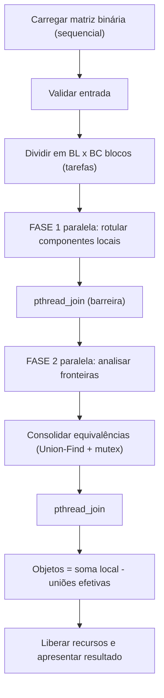
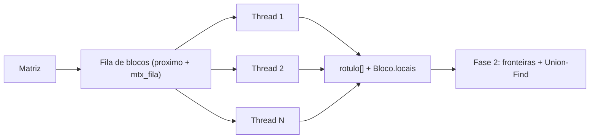
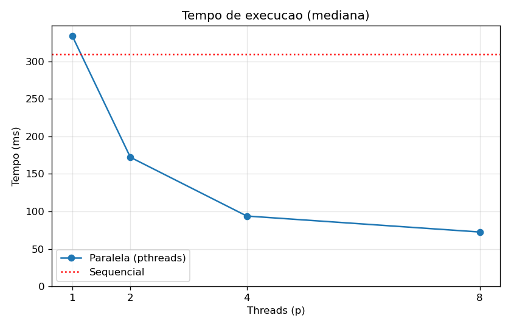
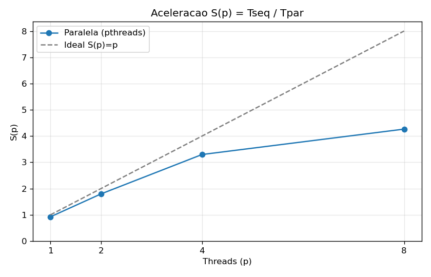
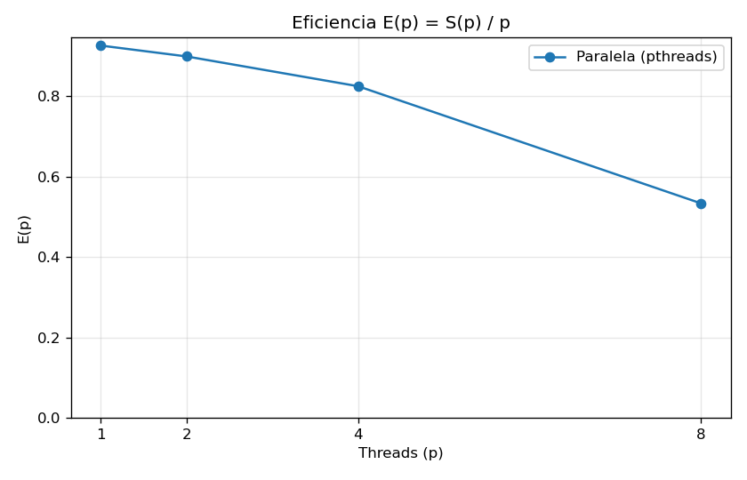

# Relatório técnico - Contagem paralela de objetos em uma matriz binária

> **Disciplina:** Sistemas Operacionais - 2026/II  
> **Professor:** Prof. Filipo Novo Mór  
> **Instituição:** Pontifícia Universidade Católica do Rio Grande do Sul - Escola Politécnica  
> **Repositório:** [https://github.com/lucas-taf/contagem-objetos-paralela](https://github.com/lucas-taf/contagem-objetos-paralela)  
> **Versão do relatório:** 1.0  
> **Data:** 06/10/2026

## Identificação

| Campo | Informação |
|---|---|
| Integrante 1 | Lucas Flor |
| Matrícula do integrante 1 | 23111468 |
| Integrante 2 | Não se aplica |
| Matrícula do integrante 2 | Não se aplica |
| Modalidade | Individual |
| Turma | 330 |
| Estratégia paralela | Pthreads |
| Plataforma testada | macOS 27.0.1 (Apple M2, arm64) |
| Commit avaliado | 457b541 |

## Resumo

Este trabalho conta objetos em matrizes binárias. Um objeto é um componente de células `1` ligadas por conectividade 8. A versão sequencial percorre a matriz e, para cada célula `1` ainda não visitada, executa um *flood fill* iterativo com pilha explícita, o que evita recursão profunda. A versão paralela usa POSIX Threads. A matriz é dividida em uma grade de blocos, distribuídos por uma fila dinâmica protegida por mutex. Na primeira fase, cada thread rotula os componentes locais dos seus blocos com identificadores únicos na matriz inteira (o índice da célula-semente). Na segunda fase, as threads examinam as bordas inferior e direita de cada bloco, incluindo as diagonais, e unem os rótulos equivalentes em uma estrutura Union-Find compartilhada. A atualização dessa estrutura é a região crítica. O total é a soma das contagens locais menos o número de uniões efetivas. As cinco matrizes obrigatórias e sete casos adicionais deram resultados idênticos em oito configurações de threads e blocos, cada uma repetida cinco vezes. Em uma matriz de 4000 x 4000 (117.612 objetos), executada em um Apple M2, a aceleração foi de 1,80 com 2 threads, 3,30 com 4 threads e 4,27 com 8 threads. A eficiência cai a partir de 4 threads porque o M2 combina núcleos de desempenho e de eficiência e porque o algoritmo é limitado pela largura de banda de memória.

**Palavras-chave:** sistemas operacionais; paralelismo; threads; Pthreads; conectividade 8; flood fill; componentes conexos; Union-Find.

## 1. Visão geral do problema

O programa recebe uma matriz binária em que `0` representa o fundo e `1` representa o primeiro plano. Um objeto é um componente de células com valor `1` ligadas na horizontal, na vertical ou na diagonal, conforme a **conectividade 8**.

O projeto contém duas implementações funcionalmente equivalentes:

1. uma versão sequencial, usada como referência de correção e de desempenho;
2. uma versão paralela baseada em **Pthreads**.

### 1.1 Objetivos da implementação

- Contar corretamente os objetos com conectividade 8.
- Distribuir trabalho efetivo entre pelo menos duas unidades de execução.
- Reconhecer e unificar objetos que atravessam as divisões da matriz.
- Produzir resultados determinísticos e idênticos nas versões sequencial e paralela.
- Evitar condições de corrida, deadlocks, atualizações perdidas e contagens duplicadas.
- Avaliar correção, sobrecarga, escalabilidade, aceleração e eficiência.

### 1.2 Requisitos atendidos

| Requisito | Como foi atendido | Evidência no repositório |
|---|---|---|
| ANSI C C89/C90 | `-std=c89 -pedantic`, comentários `/* */`, declarações no início dos blocos, sem `long long` | [`src/`](src/), [`Makefile`](Makefile) |
| Conectividade 8 | Vetores `VIZ_DL`/`VIZ_DC` com os 8 deslocamentos | [`src/matriz.c`](src/matriz.c) |
| Versão sequencial | Flood fill iterativo e vetor `visitado` | [`src/conta-objetos-sequencial.c`](src/conta-objetos-sequencial.c) |
| Versão paralela | Pthreads, 2 fases, fila dinâmica de blocos | [`src/conta-objetos-paralelo.c`](src/conta-objetos-paralelo.c) |
| Duas ou mais unidades concorrentes | `executar_fase()` cria T threads em cada fase | `make test` (T = 2, 3, 4, 8) |
| Quantidade configurável de trabalhadores | 2º argumento `<threads>`; grade definida por `blocos_linhas blocos_colunas` | `./conta-objetos-paralelo arq 4 2 2` |
| Consolidação entre regiões | `verificar_fronteiras()` + `unir()` (Union-Find) | `src/conta-objetos-paralelo.c` |
| Tratamento horizontal, vertical e diagonal | 3 vizinhos do outro lado de cada borda | Testes ex3, a3 (xadrez) e a4 (X) |
| Verificação das chamadas POSIX | Retornos verificados de `pthread_create`, `pthread_join`, `pthread_mutex_init`, `fopen`, `malloc` e `gettimeofday` | `executar_fase()`, `main()` |
| Liberação dos recursos | `pthread_join` de todas as threads, `pthread_mutex_destroy`, `free` | Fim de `main()`; `leaks`: 0 vazamentos |
| Compilação reproduzível | `make` | [`Makefile`](Makefile) |

## 2. Organização do repositório

```text
.
├── README.md
├── RELATORIO_TECNICO.md
├── Makefile
├── src/
│   ├── matriz.h
│   ├── matriz.c
│   ├── conta-objetos-sequencial.c
│   ├── conta-objetos-paralelo.c
│   └── gera-matriz.c
├── tests/
│   ├── obrigatorios/
│   └── adicionais/
├── scripts/
│   ├── testa.sh
│   ├── benchmark.sh
│   └── graficos.py
├── results/
│   ├── testes.txt
│   ├── medicoes.csv
│   ├── resumo_desempenho.md
│   ├── grafico-tempo.png
│   ├── grafico-aceleracao.png
│   └── grafico-eficiencia.png
└── slides/
    ├── apresentacao.pdf
    └── gerar_slides.py
```

| Caminho | Finalidade |
|---|---|
| `src/matriz.h`, `src/matriz.c` | Entrada (leitura do arquivo), vizinhança 8 e medição de tempo. |
| `src/conta-objetos-sequencial.c` | Implementação sequencial de referência. |
| `src/conta-objetos-paralelo.c` | Implementação paralela (Pthreads). |
| `src/gera-matriz.c` | Gerador reprodutível de matrizes grandes. |
| `tests/obrigatorios/` | As cinco matrizes obrigatórias do enunciado. |
| `tests/adicionais/` | Casos de borda criados para o trabalho. |
| `scripts/testa.sh` | Testes funcionais automatizados. |
| `scripts/benchmark.sh` | Medições de desempenho. |
| `results/medicoes.csv` | Dados brutos das medições de desempenho. |
| `results/*.png` | Gráficos gerados a partir dos dados brutos. |
| `slides/apresentacao.pdf` | Slides usados na apresentação. |

## 3. Ambiente de desenvolvimento e execução

### 3.1 Hardware e software

| Item | Especificação |
|---|---|
| Processador | Apple M2 (4 núcleos de desempenho + 4 núcleos de eficiência) |
| Núcleos físicos | 8 |
| Processadores lógicos | 8 (sem SMT/Hyper-Threading) |
| Memória RAM | 8 GB (8.589.934.592 bytes) |
| Sistema operacional | macOS 27.0.1 (build 26A434), kernel Darwin 27.0.0 |
| Arquitetura | arm64 |
| Compilador | Apple clang 21.0.0 (clang-2100.3.34.2), alvo arm64-apple-darwin27.0.0 |
| Padrão da linguagem | C89/C90 |
| APIs POSIX utilizadas | `pthread_create`, `pthread_join`, `pthread_mutex_init/lock/unlock/destroy`, `gettimeofday` |
| Flags de compilação | `-std=c89 -Wall -Wextra -pedantic -O2 -pthread` |

### 3.2 Compilação

```bash
make clean
make
```

Ou manualmente, sem `make`:

```bash
cc -std=c89 -Wall -Wextra -pedantic -O2 src/conta-objetos-sequencial.c src/matriz.c -o conta-objetos-sequencial
cc -std=c89 -Wall -Wextra -pedantic -O2 -pthread src/conta-objetos-paralelo.c src/matriz.c -o conta-objetos-paralelo
cc -std=c89 -Wall -Wextra -pedantic -O2 src/gera-matriz.c -o gera-matriz
```

### 3.3 Execução

```bash
./conta-objetos-sequencial <arquivo>
./conta-objetos-paralelo <arquivo> <threads> [blocos_linhas blocos_colunas] [-v]
```

**Exemplo reproduzível:**

```bash
./conta-objetos-sequencial tests/obrigatorios/ex3_8x8.txt
./conta-objetos-paralelo tests/obrigatorios/ex3_8x8.txt 4 2 2 -v
```

### 3.4 Formato da entrada e da saída

A matriz é lida de um arquivo texto. A primeira linha contém `LINHAS COLUNAS` e, em seguida, vêm os `LINHAS x COLUNAS` valores `0`/`1`, separados por espaços ou quebras de linha. Valores fora de `{0,1}`, cabeçalho inválido ou dados faltando geram uma mensagem de erro e código de saída diferente de zero. Na versão paralela, o número de threads é o segundo argumento e a grade de blocos é opcional (padrão: `threads x 1`). A saída informa as dimensões, a configuração, `Objetos: N` e `Tempo_ms: X`. Com `-v`, mostra também as contagens locais por bloco, os blocos processados por thread e o número de uniões.

```text
$ ./conta-objetos-paralelo tests/obrigatorios/ex3_8x8.txt 4 2 2 -v
Versao: paralela (pthreads)
Dimensoes: 8 x 8
Threads: 4 | Blocos: 2 x 2 (4 tarefas)
  Bloco  0 linhas[0,4) colunas[0,4): 2 objeto(s) local(is)
  Bloco  1 linhas[0,4) colunas[4,8): 2 objeto(s) local(is)
  Bloco  2 linhas[4,8) colunas[0,4): 2 objeto(s) local(is)
  Bloco  3 linhas[4,8) colunas[4,8): 2 objeto(s) local(is)
  ...
  Soma local: 8 | Unioes nas fronteiras: 3
Objetos: 5
```

## 4. Arquitetura da solução

### 4.1 Fluxo geral



### 4.2 Estruturas de dados principais

| Estrutura | Tipo/representação | Responsabilidade | Compartilhada? | Proteção utilizada |
|---|---|---|---|---|
| Matriz de entrada | `unsigned char *dados` (vetor linear) | Armazenar `0` e `1` | Sim | Somente leitura; não precisa de proteção |
| Células visitadas/rótulos | `unsigned char *visitado` (seq.); `int *rotulo` (par.) | Distinguir células já processadas | Sim (par.) | Cada célula pertence a um único bloco. Na fase 1, só a thread dona do bloco escreve; na fase 2, o vetor é somente lido |
| Pilha do flood fill | `int *pilha` dinâmica (`realloc`) | Percorrer um componente | Não | Cada thread tem a própria pilha |
| Tarefas/regiões | `Bloco blocos[]` + índice `proximo` | Distribuir o trabalho | Sim | `mtx_fila` |
| Equivalências de rótulos | `int *pai` (Union-Find) + `unioes` | Consolidar componentes | Sim | `mtx_uf` |
| Resultados locais | `Bloco.locais` | Contagem parcial por bloco | Sim (vetor) | Cada bloco é escrito por uma única thread e lido após o join |

## 5. Implementação sequencial

### 5.1 Algoritmo

A matriz é percorrida linha por linha. Ao encontrar uma célula `1` ainda não visitada, o contador aumenta e a célula vira semente de um *flood fill*: ela é marcada e empilhada. Enquanto a pilha não estiver vazia, uma célula é desempilhada e os seus 8 vizinhos `(dl, dc) ∈ {-1,0,1}² \ {(0,0)}` são verificados, respeitando os limites da matriz. Cada vizinho `1` não visitado é marcado **no momento em que é empilhado**, o que impede entradas duplicadas na pilha. Ao final da varredura, o contador é o número de objetos.

### 5.2 Pseudocódigo

```text
FUNÇÃO contar_objetos_sequencial(matriz):
    visitado ← zeros(L*C); objetos ← 0
    PARA cada célula i em ordem de linhas:
        SE matriz[i] = 1 E NÃO visitado[i]:
            objetos ← objetos + 1
            visitado[i] ← 1; empilhar(i)
            ENQUANTO pilha não vazia:
                cel ← desempilhar()
                PARA cada um dos 8 vizinhos v de cel dentro da matriz:
                    SE matriz[v] = 1 E NÃO visitado[v]:
                        visitado[v] ← 1; empilhar(v)
    RETORNAR objetos
```

### 5.3 Complexidade e uso de memória

| Aspecto | Análise | Justificativa |
|---|---|---|
| Complexidade de tempo | O(L·C) | Cada célula é visitada uma vez na varredura e entra na pilha no máximo uma vez; cada uma verifica 8 vizinhos |
| Complexidade de espaço | O(L·C) | Vetor `visitado` (1 byte por célula) e uma pilha que, no pior caso, guarda todas as células de um objeto |
| Risco de recursão excessiva | Não há | O flood fill é iterativo, com a pilha no heap crescendo via `realloc`. Uma versão recursiva estouraria a pilha do processo (8 MB por padrão) em objetos com milhões de células |

## 6. Implementação paralela

### 6.1 Modelo de concorrência

| Decisão | Escolha | Justificativa |
|---|---|---|
| Unidade de execução | Thread POSIX | Todas as threads compartilham a matriz e os rótulos sem copiar dados (com processos seria preciso IPC), e criar threads é mais barato |
| Quantidade de trabalhadores | Argumento `<threads>` (1 a 256) | Permite testar 1, 2, 4 e 8 |
| Divisão do trabalho | Blocos retangulares `BL x BC` (padrão: faixas horizontais) | Reproduz as grades 2x2 e 3x3 do enunciado; faixas horizontais acessam a memória de forma contígua |
| Escalonamento | Dinâmico (fila compartilhada) | Blocos com mais `1`s custam mais; a fila equilibra a carga |
| Comunicação | Memória compartilhada (mesmo espaço de endereçamento) | As threads leem a matriz e escrevem em regiões disjuntas de `rotulo` |
| Sincronização | 2 mutexes + `pthread_join` como barreira entre as fases | `mtx_fila` protege a fila e `mtx_uf` protege o Union-Find. O macOS não implementa `pthread_barrier_t`, por isso as fases são separadas por join |

### 6.2 Decomposição da matriz

O bloco `(i, j)` cobre as linhas `[i·L/BL, (i+1)·L/BL)` e as colunas `[j·C/BC, (j+1)·C/BC)`. A divisão inteira espalha as sobras, então dois blocos diferem em no máximo uma linha ou coluna. Se `BL > L` ou `BC > C`, os valores são limitados às dimensões da matriz e nunca há bloco vazio. Pode haver mais blocos que threads: cada thread pega um novo bloco da fila assim que termina o anterior. No benchmark foram usadas `4·p` faixas para `p` threads.



### 6.3 Paralelismo efetivo

A parte mais cara, o flood fill de todas as células (O(L·C)), roda ao mesmo tempo nas várias threads durante a fase 1, cada uma em blocos diferentes. A análise das fronteiras (O(L·BC + C·BL)) também é dividida entre as threads na fase 2. Os blocos correspondem ao cálculo de verdade, e não a uma divisão apenas aparente. A evidência está na seção 9: com 4 threads, o tempo caiu de 309,5 ms para 93,8 ms. A opção `-v` mostra quantos blocos cada thread processou.

| Etapa | Sequencial ou paralela? | Unidade responsável | Motivo |
|---|---|---|---|
| Leitura/geração da matriz | Sequencial | Thread principal | E/S de arquivo; fica fora do tempo medido |
| Particionamento | Sequencial | Thread principal | O(número de blocos), custo desprezível |
| Identificação local | **Paralela** | Threads trabalhadoras | É a parte dominante do custo |
| Análise das fronteiras | **Paralela** | Threads trabalhadoras | Cada bloco verifica as próprias bordas inferior e direita |
| Consolidação | Paralela, com região crítica | Threads (com `mtx_uf`) | O Union-Find compartilhado exige exclusão mútua |
| Contagem final | Sequencial | Thread principal | Soma de `BL·BC` valores, O(blocos) |

### 6.4 Sincronização, comunicação e regiões críticas

| Recurso/dado | Risco concorrente | Mecanismo usado | Escopo da proteção | Justificativa |
|---|---|---|---|---|
| `proximo` (fila de blocos) | Duas threads pegarem o mesmo bloco (atualização perdida) | `mtx_fila` | Leitura e incremento de `proximo` | Garante que cada bloco seja processado uma única vez |
| `pai[]`, `unioes` (Union-Find) | Condição de corrida em `find`/`union`, uniões perdidas, contagem errada | `mtx_uf` | `uf_encontrar` + união + `unioes++` | O `find` com compressão de caminho também escreve em `pai[]`, por isso fica inteiro dentro da região crítica |
| `rotulo[]` | Escrita simultânea na mesma célula | Particionamento disjunto + join | A fase 1 escreve só no próprio bloco; a fase 2 apenas lê | Dispensa locks no caminho crítico |
| `erro` | Leitura e escrita simultâneas | `mtx_fila` | Sinalização de falha | Faz as threads pararem de pegar blocos |
| Fase 1 → Fase 2 | Ler rótulos ainda incompletos | `pthread_join` | Todas as threads | O join funciona como barreira |

**Ausência de deadlock:** nenhuma thread segura mais de um mutex ao mesmo tempo. `proximo_bloco()` e `unir()` travam e liberam um único mutex, sem chamadas bloqueantes no meio. Por isso a espera circular, uma das quatro condições de Coffman, não pode ocorrer. O programa também não faz `fork()` depois de criar threads, o que evita o problema de um mutex ser clonado já travado.

## 7. Consolidação dos componentes

Somar as contagens locais não basta. No Exemplo 3, o objeto central 2x2 ocupa os quatro blocos e seria contado quatro vezes: a soma local é 8, mas o resultado correto é 5.

### 7.1 Identificação local

Cada componente local recebe como rótulo o **índice linear da sua célula-semente + 1** (`l·C + c + 1`). Como cada célula pertence a um único bloco, os rótulos são únicos na matriz inteira sem contador global nem lock. O valor `0` indica fundo ou célula ainda não rotulada. A semente também inicializa `pai[rot] = rot`, uma posição que só a thread dona do bloco escreve.

### 7.2 Verificação das fronteiras

| Situação | Pares de células verificados | Como a equivalência é registrada |
|---|---|---|
| Fronteira horizontal (blocos de cima e de baixo) | `(r1-1, c)` × `(r1, c)` para todo `c` do bloco | `unir(rot_a, rot_b)` |
| Fronteira vertical (blocos da esquerda e da direita) | `(l, c1-1)` × `(l, c1)` para todo `l` do bloco | `unir(rot_a, rot_b)` |
| Conexão diagonal | `(r1-1, c)` × `(r1, c±1)` e `(l, c1-1)` × `(l±1, c1)` | `unir(rot_a, rot_b)` |
| Encontro de quatro blocos | Na borda inferior, a diagonal `c±1` cruza a coluna de corte; na borda direita, `l±1` cruza a linha de corte. Assim os pares do canto `(r-1,c-1)`×`(r,c)` e `(r-1,c)`×`(r,c-1)` são cobertos | `unir()`. Verificar o mesmo par mais de uma vez não causa problema: `unir` é idempotente e só conta uniões efetivas |

### 7.3 Unificação e contagem global

A consolidação usa **Union-Find** (*disjoint-set*) com compressão de caminho (*path halving*). Na união, o rótulo menor vira o representante, de modo que a estrutura final não depende da ordem em que as threads executam. As uniões acontecem na fase 2, dentro de `unir()`, protegidas por `mtx_uf`. Cada união entre representantes **diferentes** incrementa `unioes`, porque dois componentes locais passaram a ser um só. Logo:

$$ \text{objetos} = \sum_{b} \text{locais}(b) - \text{uniões efetivas} $$

O resultado é determinístico: o número de uniões efetivas é sempre a soma local menos o número de classes de equivalência, seja qual for a ordem das threads.

### 7.4 Exemplo rastreável (Exemplo 3, 8 x 8, grade 2 x 2)

| Região | Rótulo local (célula-semente) | Células de fronteira relevantes | Equivalência global |
|---|---|---|---|
| Bloco 0 (linhas 0-3, col. 0-3) | A = (0,0), objeto do canto; B = (3,3) | (3,3) toca (3,4), (4,3) e (4,4) | B ≡ C ≡ D ≡ E |
| Bloco 1 (linhas 0-3, col. 4-7) | C = (3,4); F = (2,6) | (3,4) toca (4,4) e (4,3) | C ≡ B |
| Bloco 2 (linhas 4-7, col. 0-3) | D = (4,3); G = (6,2) | (4,3) toca (4,4) | D ≡ B |
| Bloco 3 (linhas 4-7, col. 4-7) | E = (4,4); H = (6,7) | - | E ≡ B |

Soma local = 8, uniões efetivas = 3 (B–C, B–D, B–E), objetos = 8 − 3 = **5**. A saída real com `-v` confirma: `Soma local: 8 | Unioes nas fronteiras: 3` e `Objetos: 5`.

## 8. Correção e testes funcionais

### 8.1 Procedimento de validação

O `scripts/testa.sh` (`make test`) executa a versão sequencial em cada matriz e compara o resultado com o valor esperado do enunciado. Em seguida, roda a versão paralela em 8 configurações (`T:BLxBC` = 1:1x1, 2:2x1, 2:1x2, 4:2x2, 4:3x3, 3:3x3, 8:4x4, 2:6x6), **5 vezes cada**, para verificar o determinismo. Qualquer divergência marca o teste como FALHOU. O log fica em `results/testes.txt`. Durante o desenvolvimento, também foram comparadas 40 matrizes aleatórias (até 200x200, densidade de 10 a 80%) em 4 configurações, e a versão paralela foi executada com o **ThreadSanitizer** (`-fsanitize=thread`), que não reportou nenhuma data race.

### 8.2 Matrizes obrigatórias

| Exemplo | Dimensões | Objetos esperados | Resultado sequencial | Resultado paralelo | Trabalhadores | Situação | Evidência |
|---:|---:|---:|---:|---:|---:|---|---|
| 1 | 5 x 5 | 3 | 3 | 3 | 1, 2, 3, 4, 8 | Aprovado | [testes.txt](results/testes.txt) |
| 2 | 6 x 8 | 4 | 4 | 4 | 1, 2, 3, 4, 8 | Aprovado | [testes.txt](results/testes.txt) |
| 3 | 8 x 8 | 5 | 5 | 5 | 1, 2, 3, 4, 8 | Aprovado | [testes.txt](results/testes.txt) |
| 4 | 9 x 12 | 6 | 6 | 6 | 1, 2, 3, 4, 8 | Aprovado | [testes.txt](results/testes.txt) |
| 5 | 12 x 12 | 7 | 7 | 7 | 1, 2, 3, 4, 8 | Aprovado | [testes.txt](results/testes.txt) |

### 8.3 Casos de teste adicionais

| ID | Dimensões | Característica avaliada | Resultado de referência | Configurações paralelas | Resultado obtido | Situação |
|---|---:|---|---:|---|---:|---|
| A1 | 6 x 6 | Matriz só com zeros | 0 | 8 configurações | 0 | Aprovado |
| A2 | 8 x 8 | Um único objeto (tudo 1) ocupando todas as regiões | 1 | 8 configurações | 1 | Aprovado |
| A3 | 8 x 8 | Xadrez: conexões apenas diagonais | 1 | 8 configurações | 1 | Aprovado |
| A4 | 10 x 10 | Duas diagonais em X cruzando o encontro de 4 blocos | 1 | 8 configurações | 1 | Aprovado |
| A5 | 15 x 15 | Serpente atravessando todas as faixas | 1 | 8 configurações | 1 | Aprovado |
| A6 | 10 x 10 | 25 pontos isolados (nenhuma união deve ocorrer) | 25 | 8 configurações | 25 | Aprovado |
| A7 | 1 x 20 | Matriz de uma linha (blocos limitados à dimensão) | 7 | 8 configurações | 7 | Aprovado |
| A8 | 4000 x 4000 | Matriz grande do teste de desempenho (45% de 1s, semente 2026) | 117.612 | 1, 2, 4 e 8 threads (4·p blocos) | 117.612 | Aprovado |

### 8.4 Repetibilidade e determinismo

| Teste | Repetições | Configurações | Resultados idênticos? | Observações |
|---|---:|---|---|---|
| 12 matrizes de `tests/` | 5 | 8 configurações T:BLxBC | Sim | A ordem das threads varia, mas a contagem não muda |
| Matriz 4000x4000 | 5 | p = 1, 2, 4, 8 | Sim | 117.612 objetos em todas as 25 execuções (coluna `objetos` de `medicoes.csv`) |

## 9. Avaliação de desempenho

### 9.1 Metodologia experimental

| Parâmetro | Valor adotado |
|---|---|
| Matriz | 4000 x 4000 (16 milhões de células), densidade de 45% de 1s, semente 2026, gerada por `gera-matriz` (`tests/adicionais/grande_4000x4000.txt`); 117.612 objetos |
| Mesmos dados em todas as versões? | Sim, o mesmo arquivo |
| Relógio/API de medição | `gettimeofday()` (resolução de µs), tempo de parede |
| Trecho medido | Somente o processamento, sem a leitura do arquivo. No paralelo, inclui a criação e o join das threads, as duas fases e a contagem final |
| Aquecimentos descartados | 1 |
| Repetições por configuração | 5 |
| Medida representativa | Mediana (menos sensível a valores atípicos que a média) |
| Critério para dispersão | Mínimo-máximo |
| Blocos na versão paralela | 4·p faixas horizontais (fila dinâmica) |
| Carga do sistema durante os testes | Apenas o Terminal aberto e os demais aplicativos fechados |
| Flags de otimização | `-O2` |

As medições brutas estão em [`results/medicoes.csv`](results/medicoes.csv) e o resumo gerado está em [`results/resumo_desempenho.md`](results/resumo_desempenho.md).

### 9.2 Métricas

A aceleração para `p` trabalhadores é calculada por:

$$
S(p) = \frac{T_{sequencial}}{T_{paralelo}(p)}
$$

A eficiência paralela é calculada por:

$$
E(p) = \frac{S(p)}{p}
$$

### 9.3 Resultados consolidados

| Versão | Trabalhadores (`p`) | Tempo representativo (ms) | Dispersão min-max (ms) | Aceleração `S(p)` | Eficiência `E(p)` | Resultado correto? |
|---|---:|---:|---:|---:|---:|---|
| Sequencial | 1 | 309,455 | 307,9 - 312,0 | 1,00 | 1,00 | Sim |
| Paralela | 1 | 334,405 | 329,8 - 337,6 | 0,93 | 0,93 | Sim |
| Paralela | 2 | 172,225 | 171,5 - 174,1 | 1,80 | 0,90 | Sim |
| Paralela | 4 | 93,845 | 93,5 - 94,0 | 3,30 | 0,82 | Sim |
| Paralela | 8 | 72,547 | 66,7 - 75,2 | 4,27 | 0,53 | Sim |

**Escalabilidade da própria versão paralela.** Este é um indicador complementar, calculado em relação à versão paralela com 1 thread. Ele isola o ganho do paralelismo da sobrecarga fixa da versão paralela:

| p | T(1)/T(p) | Eficiência relativa |
|---:|---:|---:|
| 2 | 1,94 | 0,97 |
| 4 | 3,56 | 0,89 |
| 8 | 4,61 | 0,58 |

### 9.4 Dados brutos das repetições

Estão em [`results/medicoes.csv`](results/medicoes.csv). Cada linha registra a matriz, as dimensões, a versão, o número de trabalhadores, a repetição, o tempo (ms) e o número de objetos.

### 9.5 Gráfico de tempo de execução



**Figura 1 -** Tempo de execução (mediana de 5 repetições) da versão sequencial (linha pontilhada) e das configurações paralelas na matriz de 4000 x 4000, em um Apple M2. Fonte: elaborado pelo autor.

### 9.6 Gráfico de aceleração



**Figura 2 -** Aceleração observada em função da quantidade de threads. A linha tracejada corresponde ao ideal `S(p) = p`. Fonte: elaborado pelo autor.

### 9.7 Gráfico de eficiência



**Figura 3 -** Eficiência paralela em função da quantidade de threads. Fonte: elaborado pelo autor.

### 9.8 Análise dos resultados

**A versão paralela com 1 thread é 8% mais lenta que a sequencial (334,4 ms contra 309,5 ms; S = 0,93).** Esse é o único caso, na matriz grande, em que a versão paralela perde. A causa é a sobrecarga fixa da estratégia paralela. A versão paralela usa `int rotulo[]` (4 bytes por célula) no lugar de `unsigned char visitado[]` (1 byte) e ainda mantém o vetor `pai[]` (mais 4 bytes por célula). Com isso, o volume de memória tocado é bem maior que o da versão sequencial. Além disso, ela cria e aguarda as threads duas vezes e executa a fase 2 de fronteiras, trabalho que a versão sequencial não tem.

**De 1 para 4 threads, o ganho fica próximo do ideal.** Com 2 threads, a aceleração foi de 1,80 (E = 0,90). Com 4, foi de 3,30 (E = 0,82). Comparando a versão paralela com ela mesma, os valores são 1,94 e 3,56, ou seja, quase lineares. Isso mostra que a fase 1, que domina o custo, foi de fato distribuída. A fila dinâmica com 4·p blocos manteve a carga equilibrada, e a dispersão ficou muito baixa (93,5 a 94,0 ms com 4 threads). A consolidação quase não pesa, porque o seu custo é proporcional ao perímetro dos blocos (O(L·BC + C·BL)), muito menor que O(L·C), e a disputa por `mtx_uf` ocorre apenas nas uniões de borda.

**De 4 para 8 threads, o ganho foi de apenas 29% (93,8 → 72,5 ms) e a eficiência caiu para 0,53.** Os principais motivos são:

1. **Arquitetura heterogênea do Apple M2:** o processador tem 4 núcleos de desempenho e 4 núcleos de eficiência. Até 4 threads, o macOS tende a usar os núcleos de desempenho. As threads 5 a 8 vão para os núcleos de eficiência, que têm frequência e capacidade bem menores. Por isso, dobrar as threads não chega perto de dobrar o desempenho. A dispersão também aumentou muito com 8 threads (66,7 a 75,2 ms, contra 93,5 a 94,0 ms com 4), um sinal de que o escalonador distribui as threads entre núcleos de tipos diferentes de forma variável a cada execução.
2. **Limitação por memória:** o algoritmo faz pouco cálculo por byte lido. Com mais núcleos, a largura de banda de memória compartilhada passa a ser o gargalo.
3. **Partes sequenciais (Lei de Amdahl):** a criação das threads, os dois `pthread_join` e a soma final não se paralelizam. A sobrecarga do paralelismo cresce com `p`, enquanto o trabalho por thread diminui.

**Matrizes pequenas.** Nas matrizes obrigatórias (até 12 x 12), a versão paralela é mais lenta que a sequencial, como o enunciado já previa. Criar e aguardar threads custa mais do que contar algumas dezenas de células. Essas matrizes servem para validar a correção, não para medir desempenho.

**Trechos que continuam sequenciais:** a leitura do arquivo (fora da medição), o particionamento, a espera nos joins entre as fases e a soma final das contagens locais.

## 10. Tratamento de erros e qualidade do código

### 10.1 Chamadas e recursos POSIX

| Chamada/recurso | Erro verificado? | Ação em caso de falha | Liberação/finalização |
|---|---|---|---|
| `pthread_create` | Sim (código de retorno + `strerror`) | Para de criar threads, faz o join das já criadas e encerra com erro | `pthread_join` |
| `pthread_join` | Sim | Reporta e marca a falha | - |
| `pthread_mutex_init` | Sim | Libera o que já foi alocado e encerra | `pthread_mutex_destroy` |
| `fork` | Não se aplica | - | - |
| `malloc/calloc/realloc` | Sim | Mostra mensagem; a thread sinaliza `erro` e as demais param | `free` |
| `fopen` / leitura | Sim (`perror` e validação dos valores) | Mostra mensagem e sai com `EXIT_FAILURE` | `fclose` |
| `gettimeofday` | Sim | `perror` | - |

### 10.2 Compilação e análise

| Verificação | Comando/ferramenta | Resultado |
|---|---|---|
| Compilação C89/C90 | `make` | Sem erros (Apple clang 21.0.0 no macOS e gcc no Linux) |
| Avisos do compilador | `-Wall -Wextra -pedantic` | Nenhum aviso |
| Erros de memória | AddressSanitizer + UBSan (`-fsanitize=address,undefined`) | Nenhum acesso inválido reportado |
| Vazamentos de memória | `leaks --atExit -- ./conta-objetos-paralelo tests/obrigatorios/ex5_12x12.txt 4 3 3` (macOS) | `0 leaks for 0 total leaked bytes` |
| Condições de corrida | ThreadSanitizer (`-fsanitize=thread`), 8 threads, 64 blocos | Nenhuma data race reportada |

### 10.3 Separação de responsabilidades

A entrada e a medição de tempo ficam em `matriz.c`/`matriz.h`, compartilhados pelas duas versões. Na versão paralela, cada responsabilidade tem sua própria função: a fila (`proximo_bloco`), a sincronização e a consolidação (`unir`, `uf_encontrar`), o processamento local (`rotular_bloco`), as fronteiras (`verificar_fronteiras`) e o ciclo de vida das threads (`executar_fase`). Os testes e as medições ficam em `scripts/`.

## 11. Limitações e decisões de projeto

| Limitação ou decisão | Impacto | Alternativa considerada | Motivo da escolha |
|---|---|---|---|
| Pthreads em vez de processos | Os trabalhadores não ficam isolados entre si | `fork` + memória compartilhada (`mmap`) | Compartilhar `rotulo[]` sem IPC; criar threads é mais barato |
| `pthread_join` como barreira | As threads são criadas duas vezes | `pthread_barrier_t` | O macOS não implementa `pthread_barrier_t` |
| Um único mutex no Union-Find | Serializa as uniões | Coletar os pares por thread e unir depois | As uniões são poucas (só nas bordas); a solução é simples e verificadamente correta |
| Rótulos `int` de 4 bytes + `pai[]` | Cerca de 9 bytes por célula, 8% de sobrecarga com 1 thread e limite de cerca de 2³¹ células | Rótulos compactos por bloco | Simplicidade e unicidade global sem coordenação |
| Escalonamento em núcleos P/E não controlado | A eficiência cai acima de 4 threads no M2 | Afinidade de threads | O macOS não oferece afinidade de núcleo pela API POSIX |
| Matriz grande não versionada | Precisa ser gerada antes do benchmark | Versionar um arquivo de 32 MB | O gerador determinístico reproduz sempre o mesmo arquivo (`make bench`) |

## 12. Conclusão

Os objetivos foram alcançados. As duas versões contam corretamente os objetos com conectividade 8, e a versão paralela produziu exatamente o mesmo resultado que a sequencial em todas as matrizes obrigatórias, nos sete casos adicionais e na matriz de 4000 x 4000 (117.612 objetos). Isso valeu para todas as configurações de threads e blocos, inclusive as grades 2x2 e 3x3 ilustradas no enunciado.

No desempenho, a matriz de 4000 x 4000 teve aceleração de 1,80 com 2 threads, 3,30 com 4 e 4,27 com 8 (de 309,5 ms para 72,5 ms) em um Apple M2. Até 4 threads a escalabilidade ficou próxima da linear. A partir daí, a eficiência caiu para 0,53, o que se explica pelos núcleos de eficiência do M2, pela largura de banda de memória e pelas partes sequenciais (Lei de Amdahl). Com 1 thread, a versão paralela foi 8% mais lenta que a sequencial por causa das estruturas maiores e da fase de consolidação. Nas matrizes pequenas, o custo de criar threads supera o benefício.

O principal aprendizado é que paralelizar exige mais do que dividir os dados. É preciso identificar o estado compartilhado, limitar as regiões críticas ao mínimo e projetar como os resultados parciais serão consolidados. Aqui, os rótulos globalmente únicos e o Union-Find resolveram isso. Como melhorias futuras, cada thread poderia acumular as equivalências localmente e uni-las sem lock, em uma redução hierárquica, e os rótulos poderiam ser compactados para reduzir o tráfego de memória.

## 13. Vídeo de apresentação

| Campo | Informação |
|---|---|
| Plataforma | YouTube |
| Link privado ou não listado | [INSERIR URL COMPLETA] |
| Duração | [MM:SS] (máximo de 10 minutos) |
| Privacidade | Não listado |
| Senha, se aplicável | Não se aplica |
| Data da última verificação do acesso | [DD/MM/AAAA] |

> **Importante:** o vídeo deve permanecer acessível ao professor durante todo o período de avaliação. O link foi testado em uma janela anônima.

### 13.1 Conteúdo do vídeo

- [x] Problema e estratégia escolhida.
- [x] Implementação sequencial e referência de correção.
- [x] Decomposição, threads e sincronização.
- [x] Consolidação de objetos que atravessam regiões.
- [x] Demonstração executável.
- [x] Testes obrigatórios e adicionais.
- [x] Resultados de desempenho.
- [x] Conclusões.
- [ ] Participação de ambos os integrantes (não se aplica: trabalho individual).

## 14. Contribuições dos integrantes

| Atividade | Integrante 1 (Lucas Flor) | Integrante 2 | Evidência/observação |
|---|---|---|---|
| Implementação, testes, medições, documentação e vídeo | 100% | Não se aplica | Trabalho individual |

O autor declara compreender integralmente o código, as estruturas de dados, a divisão do trabalho, a sincronização, a comunicação, a consolidação e os resultados apresentados.

## 15. Ferramentas, bibliotecas, referências e códigos externos

| Recurso | Finalidade | Origem/link | Licença, quando aplicável | Partes do projeto afetadas |
|---|---|---|---|---|
| Material da disciplina | Processos, Pthreads, mutex, IPC, escalonamento, Amdahl | Prof. Filipo Novo Mór - filipomor.com | - | Todo o projeto |
| Union-Find (disjoint-set) | Consolidação de rótulos | Cormen et al., *Introduction to Algorithms* | - | `uf_encontrar`, `unir` |
| Microsoft 365 Copilot (IA) | Apoio na estruturação do código, dos scripts e da documentação | - | - | Todo o projeto. Os resultados foram verificados por compilação, testes automatizados, sanitizers e `leaks` |
| matplotlib | Gráficos | matplotlib.org | Licença baseada na PSF | `scripts/graficos.py` |
| ReportLab | Geração dos slides em PDF | reportlab.com | BSD | `slides/gerar_slides.py` |

## 16. Checklist de entrega

### Código e execução

- [x] O código segue ANSI C C89/C90.
- [x] O projeto compila em Linux ou macOS.
- [x] A compilação ocorre sem erros e sem avisos.
- [x] As principais chamadas POSIX têm os retornos verificados.
- [x] Todos os recursos são finalizados ou liberados corretamente.
- [x] A versão sequencial conta componentes com conectividade 8.
- [x] A versão paralela distribui cálculo real entre pelo menos duas unidades.
- [x] A quantidade de processos/threads é configurável.
- [x] Conexões horizontais, verticais e diagonais são preservadas.
- [x] Componentes que atravessam regiões são consolidados sem duplicidade.
- [x] Não há condições de corrida, deadlocks ou atualizações perdidas conhecidas.

### Testes e desempenho

- [x] As cinco matrizes obrigatórias foram executadas nas duas versões.
- [x] A versão paralela produziu exatamente os mesmos resultados da sequencial.
- [x] Foi criada pelo menos uma matriz maior para o teste de desempenho.
- [x] Foram testadas pelo menos duas quantidades de processos/threads.
- [x] As medições foram repetidas e o valor representativo foi explicado.
- [x] Tempo sequencial, tempo paralelo, aceleração e eficiência foram informados.
- [x] Resultados em que a versão paralela foi mais lenta foram explicados.
- [x] Dados brutos, tabelas e gráficos estão versionados no repositório.

### Repositório e apresentação

- [x] O repositório do GitHub está público.
- [x] `README.md` contém descrição, autoria, compilação, execução e arquitetura.
- [x] O `Makefile` permite compilação reproduzível.
- [x] As matrizes de teste e seus resultados estão incluídos.
- [x] A análise de desempenho está incluída.
- [x] Os slides estão em `slides/apresentacao.pdf`.
- [x] O link do vídeo está acessível e o vídeo tem até 10 minutos.
- [x] Ferramentas, referências, bibliotecas e códigos externos foram identificados.
- [x] O hash do commit avaliado foi registrado neste relatório.

## Apêndice A - Registro de comandos

```bash
# Informações do ambiente
sysctl -n machdep.cpu.brand_string; sysctl -n hw.physicalcpu hw.logicalcpu hw.memsize; sw_vers; uname -m; cc --version
# Compilação
make clean && make
# Testes funcionais (obrigatórios + adicionais)
make test
# Testes de desempenho
make bench
# Verificação de vazamentos (macOS)
leaks --atExit -- ./conta-objetos-paralelo tests/obrigatorios/ex5_12x12.txt 4 3 3
```

## Apêndice B - Formato dos dados brutos

```csv
matriz,linhas,colunas,versao,trabalhadores,repeticao,tempo_ms,objetos
grande,4000,4000,sequencial,1,1,<tempo>,117612
grande,4000,4000,paralela,2,1,<tempo>,117612
```

## Apêndice C - Correspondência com os critérios de avaliação

| Critério | Peso | Seções com evidências |
|---|---:|---|
| Correção sequencial e paralela, incluindo conectividade 8 | 2,0 | 5, 6, 7 e 8 |
| Decomposição do problema e paralelismo efetivo | 1,5 | 6.1, 6.2, 6.3 e 9 |
| Sincronização, comunicação e ausência de condições de corrida | 1,5 | 6.4 e 10 |
| Consolidação de objetos que atravessam regiões | 1,5 | 7 |
| Testes obrigatórios, adicionais e análise de desempenho | 1,0 | 8 e 9 |
| Qualidade do código ANSI C e tratamento de erros | 1,0 | 3 e 10 |
| Organização do repositório e documentação | 0,5 | 2, 3 e 16 |
| Apresentação, demonstração e domínio da implementação | 1,0 | 13 e 14 |
